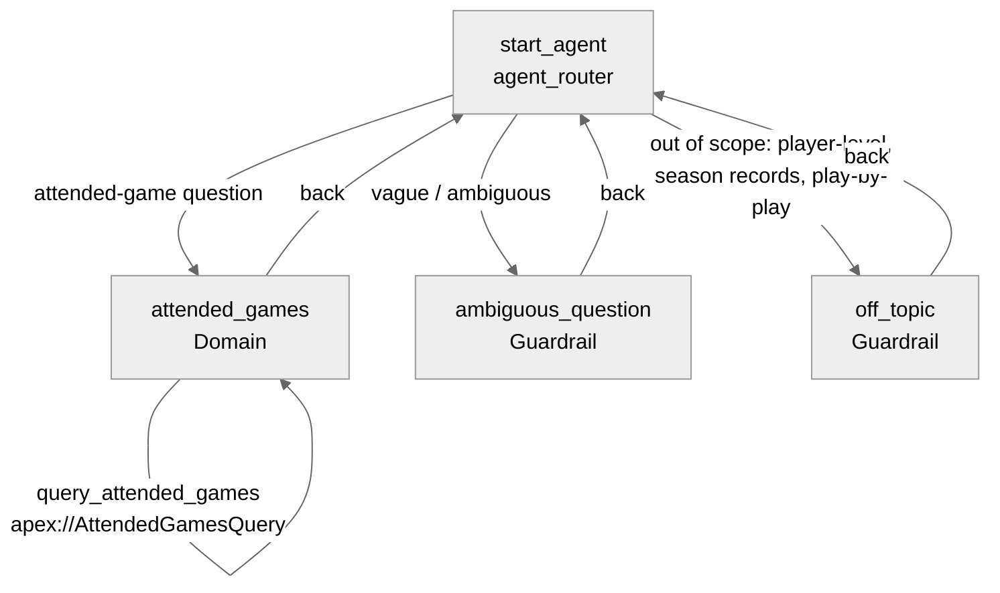

# Agent Spec: Baseball_Scout

## Purpose & Scope

**Baseball Scout** answers natural-language questions about the baseball games George "Wax" Weatherwax has **personally attended** — the 178-game spine (1984–2025) — grounded in the Salesforce Data 360 `Attended_Games` DMO. It answers *attended-game facts* (which teams, when, where, how many) and **honestly declines or clarifies** anything beyond that data, rather than guessing.

Maps to `wax-baseball/agentforce-architecture-decisions.md` (ADR-2 grounding scope, ADR-3 hybrid boundary, ADR-4 escalation).

## Behavioral Intent

- **Grounded, not generative (ADR-3):** every fact, date, team, venue, and count comes from the `query_attended_games` action (a deterministic DMO query). **The agent never states a fact it didn't retrieve.** No inference, no training-data recall about specific games.
- **Counts come from the query, not the LLM:** "how many games at the old Stadium" → the action returns `matchCount`; the LLM never counts rows itself.
- **Decline-don't-bluff (ADR-4):** out-of-scope questions — anything **player-level** ("which Hall of Famers did I see"), **season records**, **play-by-play** — route to `off_topic`, which declines honestly and names what data would be needed (the planned play-by-play enrichment). The agent does **not** infer a player was present because a team was.
- **Clarify ambiguity (ADR-4):** vague questions ("that one playoff game") route to `ambiguous_question` for a clarifying follow-up instead of guessing.
- **Backing logic:** one invocable Apex action querying the `Attended_Games` DMO (Data Cloud). No Flows or Prompt Templates in v1.
- **State:** none persists across turns — each question is answered independently. (No identity/session state needed.)

## Subagent Map

## Variables

- **None required.** Stateless QA — no persistent state across subagents. (Gating section confirms this is considered, not overlooked.)

## Actions & Backing Logic

### query_attended_games (attended_games subagent)

- **Target:** `apex://AttendedGamesQuery`
- **Backing Status:** NEEDS IMPLEMENTATION (functional invocable Apex; no existing logic)

#### Inputs — all optional; the LLM slot-fills (`...`) whichever the question implies

| Name | Type | Required | Source |
|------|------|----------|--------|
| team | string | No | User input — matches home OR away team name |
| season | integer | No | User input — the year of the game |
| venue | string | No | User input — ballpark name |
| city | string | No | User input |
| state | string | No | User input — 2-letter code |
| gameType | string | No | User input — e.g. "Regular Season", "Playoff" |

#### Outputs

| Name | Type | Visible to User? | Source | Notes |
|------|------|-------------------|--------|-------|
| games | list[object] | Yes | `Attended_Games__dlm` | Matching attended games (date, away team, home team, venue, city, state, game type) |
| matchCount | number | Yes | Computed in Apex | Count of matches — used for "how many" without listing rows |
| hasData | boolean | No | Computed | Internal empty-result flag |

#### Stubbing / Implementation Requirement

- Invocable Apex class `AttendedGamesQuery` with inner `Request` (the 6 optional filters) and inner `GameInfo` (the row shape) + `Result` (games list, matchCount, hasData).
- `complex_data_type_name` for `games`: `@apexClassType/c__AttendedGamesQuery$GameInfo`.
- Logic: apply provided filters (team → home OR away; season → year of Game Date) against the `Attended_Games` DMO, bulkified; return matching rows + total count.
- **⚠️ ONE REAL UNKNOWN to resolve at implementation:** the exact Apex mechanism to query a Data Cloud **DMO** (`Attended_Games__dlm`). Candidates: SOQL on the `__dlm` object if queryable in Apex; the Data Cloud Query Connect API in Apex; or fallback to an autolaunched **Flow** with a Data Cloud Get-Records element wired as `flow://`. Confirm during build before committing the Apex.

### aggregate_attended_games (attended_games subagent)

- **Target:** `apex://AttendedGamesAggregate`
- **Backing Status:** NEEDS IMPLEMENTATION (functional invocable Apex; GROUP BY over the DMO)
- **Why:** answers "aggregate" team/venue/season questions — *which* home teams / away teams / ballparks / years I saw most — across all my games, not just the Yankees. **Counts only — NOT win/loss records** (the DMO has no outcomes; see limitation below).

#### Inputs

| Name | Type | Required | Source |
|------|------|----------|--------|
| groupBy | string | Yes | User input — one of: `home_team`, `away_team`, `venue`, `season`, `gameType`, `state` |
| team | string | No | Optional scope filter (home OR away) |
| season | integer | No | Optional scope filter |

#### Outputs

| Name | Type | Visible to User? | Source | Notes |
|------|------|-------------------|--------|-------|
| groups | list[object] | Yes | `Attended_Games__dlm` | Each: `groupValue` (string) + `gameCount` (number), ordered desc |
| hasData | boolean | No | Computed | Internal empty flag |

- `complex_data_type_name` for `groups`: `@apexClassType/c__AttendedGamesAggregate$GroupCount`.
- Logic: `SELECT <groupBy>, COUNT(*) ... GROUP BY <groupBy> ORDER BY COUNT(*) DESC`, with optional scope filters. Same Data-Cloud-query mechanism as `query_attended_games` (resolve once, reuse).

## Gating Logic

- **No gating required.** Single-domain agent; all actions always available within `attended_games`. Scope is enforced structurally: the action can *only* return attended-games data, so out-of-scope questions have no action that answers them and route to `off_topic`. (Considered, not overlooked.)

## Architecture Pattern

**Hub-and-spoke.** `agent_router` (start) routes to one domain subagent (`attended_games`) and the two standard guardrails (`off_topic`, `ambiguous_question`). No escalation subagent — this is an employee agent with no human-handoff channel; "escalation" here = honest decline + clarify per ADR-4.

## Agent Configuration

- **developer_name:** `Baseball_Scout`
- **agent_label:** `Baseball Scout`
- **agent_type:** `AgentforceEmployeeAgent` — reasoning: internal, self-serve "talk to it" agent for the owner; no customer-facing messaging channel.
- **default_agent_user:** N/A — employee agent (MUST NOT be set; setting it breaks publish/preview).
- **welcome message:** *"Hi — I'm your Baseball Scout. Ask me about the games you've been to: which teams, when, where, how many. (178 games, 1984–2025.)"*
- **personality:** knowledgeable, warm, concise — a baseball historian who sticks to the facts.
- **error message:** *"Something went wrong on my end — mind asking that again?"*

## Known v1 limitations (honest scope)

- **Win/loss RECORDS are NOT possible in v1.** `attended_games` has no game **outcome** (no score, no winner) — so "the home teams' record in my games" can't be computed. Records need the **`fct_games`** Retrosheet outcome data = **v1.1 enrichment** (the *second* driver for the play-by-play/Retrosheet pull, alongside player-level questions). `off_topic` declines records honestly.
- v1 *does* handle **counts and breakdowns** by home/away team, venue, season, game type (`aggregate_attended_games`) and filtered lists ("games in 2008," "how many at Yankee Stadium," "Yankees home games").
- **Player-level questions** ("which Hall of Famers did I see") are out of scope until the same enrichment lands (`fct_attended_appearances` dbt mart) — `off_topic` declines them honestly.
</content>
