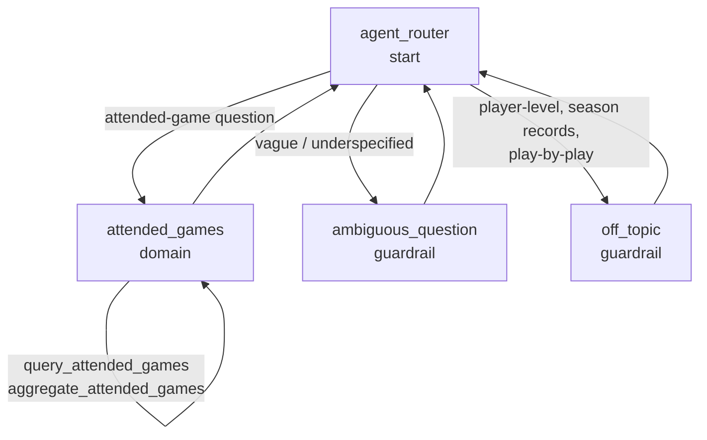

# Baseball Scout — an Agentforce agent built as code

A grounded question-answering agent over the **178 baseball games I have personally attended** (1984–2025), built with **Agentforce Agent Script** rather than the GUI builder, and backed by Salesforce **Data 360** (Data Cloud) via invocable Apex.

Ask it *"how many games did I see at the old Yankee Stadium?"* and it answers **100** — because it queried the data. Ask it *"did I ever see Derek Jeter play?"* and it declines honestly, because that fact isn't in the dataset and guessing would be worse than saying so.

This repo is the source for that agent. It's part of **[Keeping Score](https://nobodybeatstheviz.com/bits/wax-baseball/)** — a project tracing one dataset from the stands, through a semantic layer, to an agent.

---

## What's interesting here

Most agent demos show the happy path. The two things worth reading in this repo are the failures I caught and what each one turned out to be.

### 1. The agent that answered without looking

First live preview, asked how many games at Yankee Stadium I. It returned **9**. Confidently.

The session trace showed `tool_invocations: null` — the LLM had never called the action. It answered from its own head. Nothing in the output *looked* wrong; it was a plausible number in a plausible sentence.

**The fix was in the instructions, not the code:** the subagent now states that it has no knowledge of its own and *must* call an action before stating any fact. Re-test returned **100**, correct.

That's the grounding contract for this whole project: **the agent never states a fact it didn't retrieve.**

### 2. The agent that looked without seeing

Later: *"what percentage of games were Yankees games?"* → **0%.** Also wrong, but wrong in a completely different way.

The trace showed the action *was* called. The agent faithfully reported the number it got back. The defect was one string comparison — the Apex team filter used exact match, so `"Yankees"` could never equal the stored value `"New York Yankees"`. Zero rows, honestly reported.

**Grounding failure vs. data-logic failure.** The first bug was the agent lying. The second was the agent telling the truth about bad input. They look identical from the chat window and need opposite fixes — telling them apart is the actual job.

Ground truth was established *first*, with anonymous Apex against the DMO, before touching the code:

| Match on 178 rows | Count |
|---|---|
| Home team contains "Yankees" | 123 |
| Away team contains "Yankees" | 20 |
| **Either — what the filter is documented to mean** | **143** |
| Exact `equalsIgnoreCase('Yankees')` | **0** |

That last row is the bug, isolated. But the table also caught a **second, quieter error** — in my own definition of "correct." The obvious answer was 123 (home games). The right answer is 143, because the filter means home *or* away. Fixing the match without pinning the semantics would have swapped one wrong number for another.

Fixed at both layers and verified at both: the action returns 143, and the agent says *"143 Yankees games out of 178 — 80.3%."* Non-regression held (Yankee Stadium I still returns 100; the Jeter question still declines).

The `@InvocableVariable` descriptions were updated too, since **the action's self-description is part of the contract the LLM reads** — the fix isn't done until the description matches the behavior.

---

## Architecture

Hub-and-spoke. One domain subagent, two guardrails, no escalation path (this is an employee agent — "escalation" means declining honestly).



Scope is enforced **structurally**, not just by instruction: the actions can only return attended-games data, so out-of-scope questions have no action that could answer them.

### Actions

| Action | Backing | What it does |
|---|---|---|
| `query_attended_games` | `apex://AttendedGamesQuery` | Six optional filters (team, season, venue, city, state, game type) → matching games + `matchCount` |
| `aggregate_attended_games` | `apex://AttendedGamesAggregate` | GROUP BY over home team / away team / venue / season / game type / state → ranked counts |
| `query_keeping_score` | `apex://KeepingScoreQuery` | Governed metrics from the `Keeping_Score` semantic data model via `/semantic-engine/gateway` — home runs / runs witnessed, Hall of Famers seen, games + stadiums, a team's attended win rate (`keeping_score` subagent, v1.2) |

**Counts come from the query, never from the LLM.** "How many" is answered by `matchCount` — the model is never asked to count rows it's looking at.

### Grounding

Salesforce Data 360 DMO `Attended_Games__dlm`, 178 rows, 1984–2025.

One unknown had to be resolved during the build: how to query a Data Cloud DMO from Apex. Candidates were the Query Connect API, or a Flow with a Data Cloud Get-Records element. It turned out the DMO is `queryable: true`, so **plain Apex SOQL works** — no special API, and at 178 rows the filtering and aggregation happen Apex-side.

---

## The "on this date" Slack push (2026-09-10)

The retroactive action on this surface: each morning, the attended games that fall on today's month
and day, posted to Slack. Zero LLM in the loop -- it is a query and a render, which is the point:
the agent surface and the push share one data path (`Attended_Games__dlm`) and one credential model.

- `OnThisDateDigest` -- invocable (for the agent or a Flow) **and** `Schedulable`. Queries the DMO
  by SOQL, filters month/day in Apex, renders Slack mrkdwn ("*1999* -- Texas at New York Yankees,
  Yankee Stadium I (Playoff) -- 27 years ago"). `scripts/apex/schedule_on_this_date.apex` schedules it
  daily at 09:00 under the running user.
- `SlackWebhookPost` -- posts through the `Slack_Webhook` named credential (host only). **The webhook
  URL's path is the secret**, held in the protected custom setting `Keeping_Score_Settings__c` and set
  by `scripts/set_slack_webhook.py <url>` -- never in source, never in metadata.
- Why not native Salesforce-to-Slack: it needs a paid workspace and org-side provisioning a Developer
  Edition doesn't have. An incoming webhook works on a free workspace. Why Apex `Schedulable` and not
  a Scheduled Flow: scheduled Flows run as the Automated Process user, which can't hold the named
  credential's principal. Why `Custom` on the external credential with an empty principal: the
  metadata API rejects `NoAuthentication` (measured 2026-09-10).

Setup, once: deploy → assign `Keeping_Score_Slack_Push` → create a Slack app with an incoming webhook →
`python scripts/set_slack_webhook.py https://hooks.slack.com/services/...` → `sf apex run -f
scripts/apex/test_slack_push.apex` → `sf apex run -f scripts/apex/schedule_on_this_date.apex`.

## Honest limitations (v1)

- **No win/loss records.** The dataset has no game outcomes — no score, no winner. "What's the Yankees' record in games I attended?" is not answerable and gets declined rather than guessed. Records need Retrosheet outcome data (a planned enrichment).
- **No player-level questions.** "Which Hall of Famers did I see?" is out of scope until a play-by-play mart lands. The agent does **not** infer that a player was present because his team was.
- **Stateless.** Each question is answered independently; nothing persists across turns.

These are declines, not gaps in the writeup. The agent names what data would be needed.

---

## Repo layout

```
force-app/main/default/
  aiAuthoringBundles/Baseball_Scout/   the Agent Script source (.agent)
  genAiPlannerBundles/                 planner bundle + action schemas
  bots/                                bot + bot version metadata
  classes/                             AttendedGamesQuery, AttendedGamesAggregate
Baseball_Scout-AgentSpec.md            the design spec written before the build
```

`Baseball_Scout-AgentSpec.md` is worth a look — it's the spec as written *before* implementation, including the open unknown and the gating logic considered-and-rejected. It hasn't been backfilled to look prescient.

---

## Notes if you're reading this to build something similar

- **`topic` is deprecated — use `subagent`.** The generator still emits the old keyword; the linter catches it.
- **Don't set `default_agent_user` on an employee agent.** It breaks publish and preview.
- Piping `sf … --json` into a parser can break — the CLI's "update available" notice bleeds into stdout.
- Apex-only changes don't need a re-publish. The activated agent calls the same org-level classes, so deploying the classes fixes the live agent.
- **An employee agent runs its actions as the logged-in user, not as the Einstein Agent User.** Grants the actions need — here, External Credential principal access for the Named Credential that `KeepingScoreQuery` calls out through — go on the people who chat with the agent (`Keeping_Score_Gateway_Access` permission set). A grant on the agent user checks out everywhere and never takes effect.
- **`is_displayable: True` on scalar outputs lets the planner show a card and write no prose.** Live preview looks fine; the Testing Center scores an empty answer. Reasoning-only outputs plus "write the answer from the values" is the shape for metric answers.
- Recreate the Testing Center spec (`sf agent test create --force-overwrite`) after the *last* `sf agent publish`, never before — a stale compiled spec routes every utterance to `off_topic`.

This repo contains metadata only — no org credentials, no session state. `.sfdx/` and `.sf/` are ignored by design.

---

*Built by George "Wax" Weatherwax — [nobodybeatstheviz.com](https://nobodybeatstheviz.com) · Same questions. New tools.*
